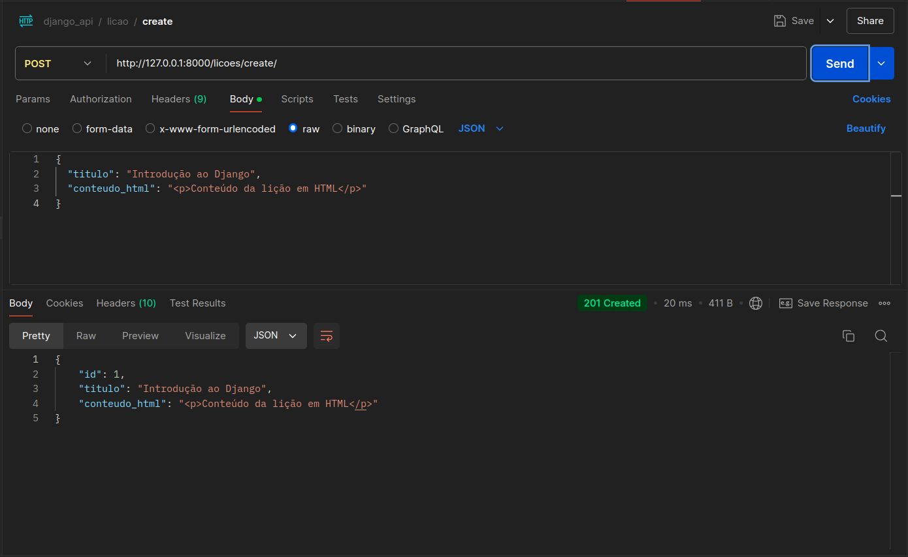
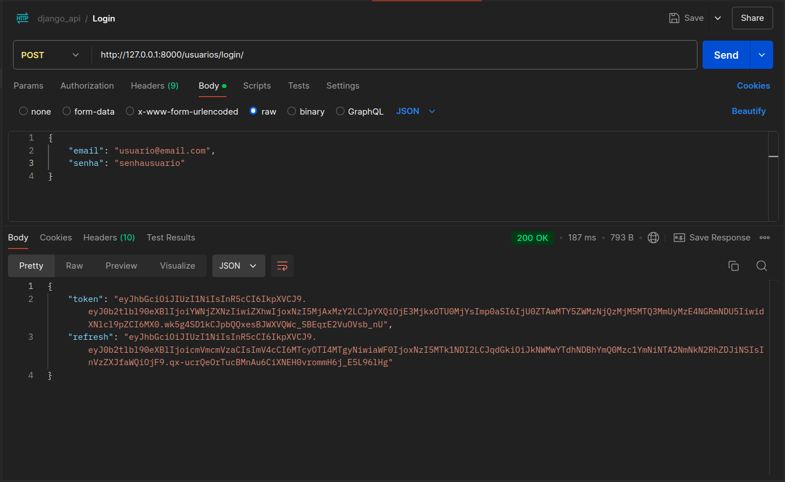
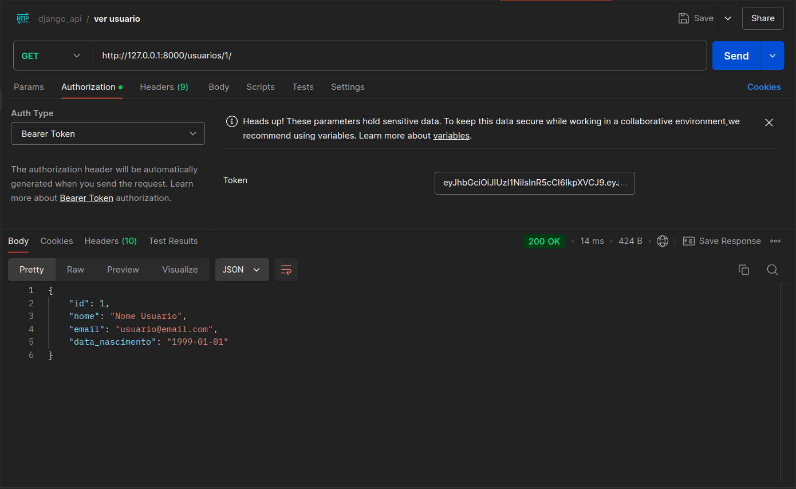
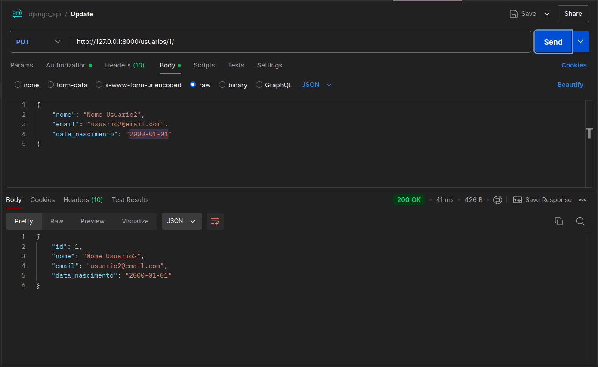
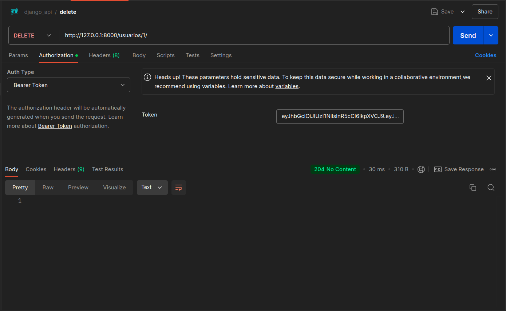
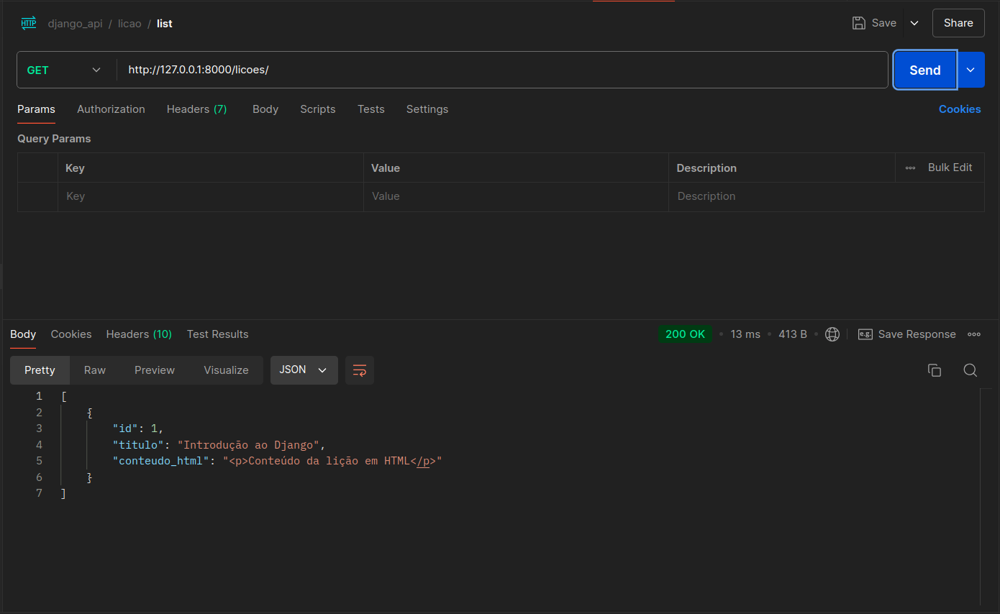
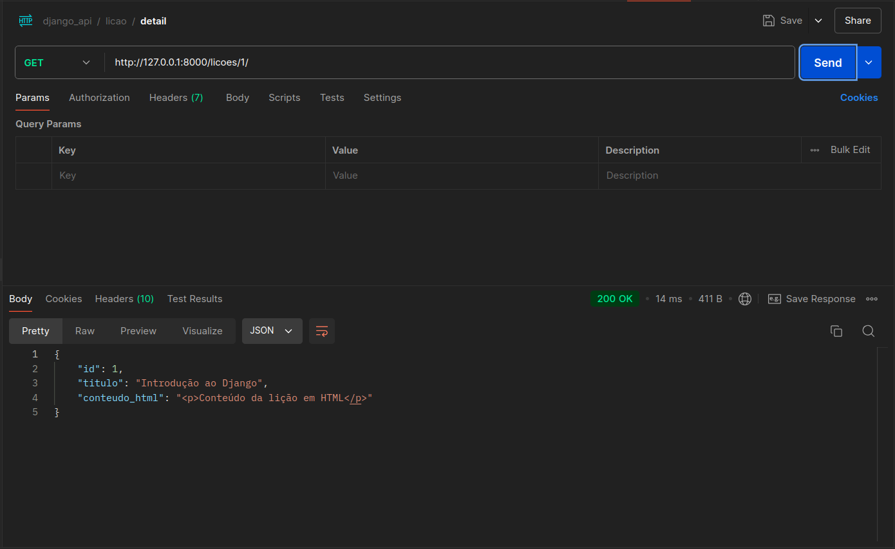
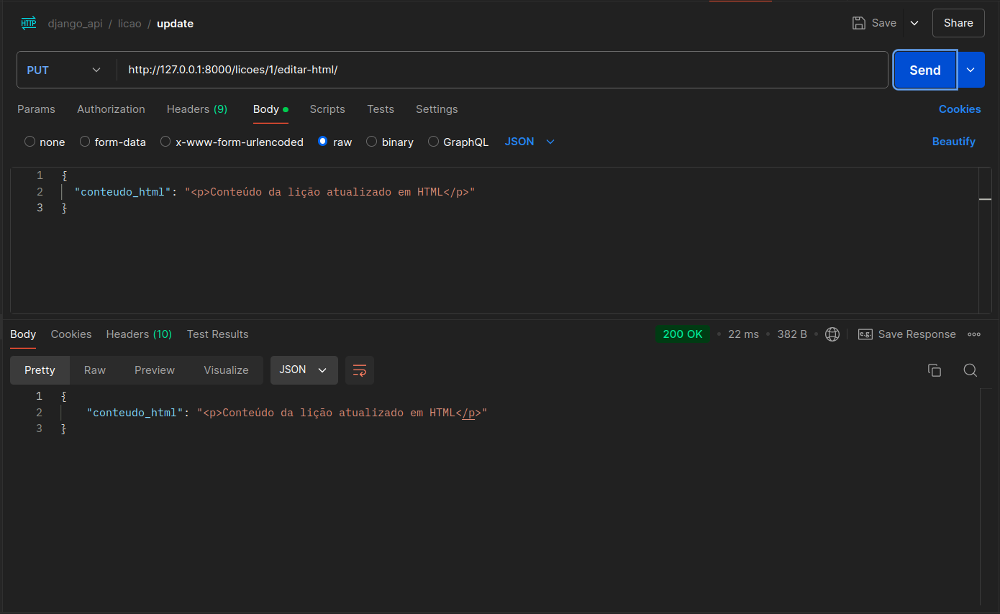
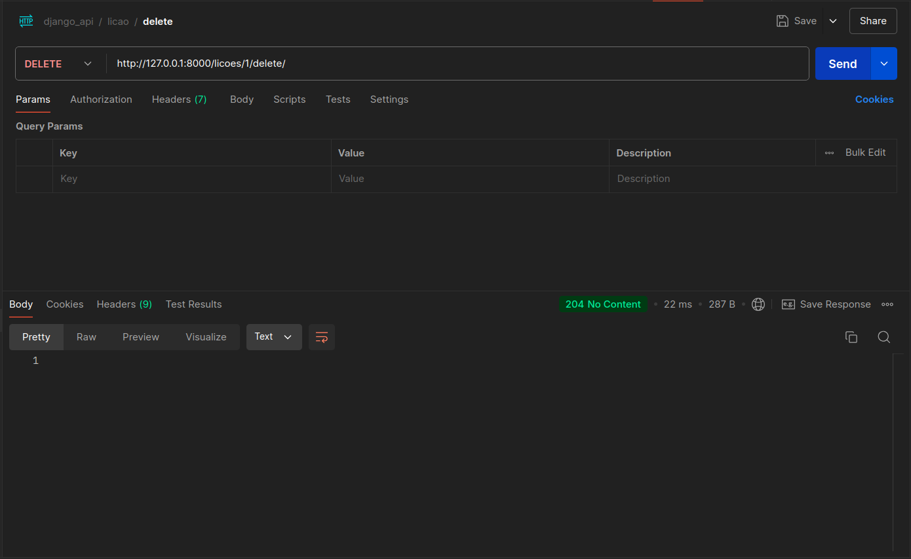

# Desafio Técnico: API de Usuários e Manipulação de Conteúdo HTML

## Objetivo

O objetivo deste desafio técnico da **GoAndSlay** é desenvolver uma API RESTful utilizando Django e PostgreSQL, que permita o gerenciamento de usuários e a manipulação de conteúdo HTML. O projeto será dividido em duas partes principais:

1. **CRUD de Usuário e Autenticação** :

* Implementar um modelo de usuário com os campos `nome`, `email`, `senha` e `data_de_nascimento`.
* Criar endpoints para permitir a criação, leitura, atualização e exclusão de usuários, garantindo que apenas usuários autenticados possam acessar essas rotas.
* Utilizar um sistema de autenticação baseado em tokens (JWT ou Django Token Authentication), que permitirá que os usuários façam login e recebam um token de acesso.

2. **Manipulação de HTML Armazenado no Banco** :

* Adicionar um modelo denominado `Licao`, que irá armazenar o conteúdo HTML de uma lição, contendo os campos `titulo` e `conteudo_html`.
* Implementar um endpoint que possibilite a edição do conteúdo HTML armazenado, permitindo que o usuário modifique o estilo do HTML ou adicione funcionalidades em JavaScript.

## Tecnologias Usadas

<div align="left">
  
  
  
  
  
  
  
  
  
  
  
  
  
  
  
</div>

## Instalação

Para configurar o ambiente de desenvolvimento e executar a API, siga os passos abaixo:

### Pré-requisitos

* **Python** (versão 3.12 ou superior)
* **PostgreSQL** (versão 13 ou superior)
* **pip** (gerenciador de pacotes do Python)
* **virtualenv** (opcional, mas recomendado)

### Passos para Instalação

1. **Clone o repositório:**

```bash
git clone https://github.com/BrunoPinheirofe/django_teste_tecnico_goandslay.git

cd django_teste_tecnico_goandslay
```

2. **Crie um ambiente virtual (opcional):**

```bash
python -m venv .venv
```

Ative o ambiente virtual:

- **No Windows**

```bash
venv\Scripts\activate
```

- **No Linux**

```bash
source venv/bin/activate
```

3. **Instale as dependências:**

```bash
pip install -r requirements.txt
```

4. **Configurando o Banco de Dados**

   - Renomeie o arquivo **`.env_exemplo`** para **`.env`** e preencha as informações do banco de dados:

     ```env
     DB_NAME=NOME_DO_BANCO
     DB_USER=NOME_USUARIO
     DB_HOST=HOST_DO_BANCO
     DB_PORT=PORTA_DO_BANCO
     POSTGRES_PASSWORD=SENHA_DO_BANCO
     ```
5. **Inicie o serviço com Docker Compose:**

- Execute o seguinte comando para iniciar o banco de dados:

```bash
docker-compose up -d
```

Isso iniciará um contêiner com PostgreSQL, mapeando a porta 5432 e utilizando o arquivo .env para as variáveis de ambiente.

6. **Realizar as migrações:**

- Após o contêiner estar em execução, você pode realizar as migrações localmente. Para isso, execute:

```bash
python manage.py migrate
```

7. **Inicie o servidor de desenvolvimento:**

- Após as migrações, inicie o servidor Django normalmente:

8. **Acesse a API:**

- Abra seu navegador e vá para **`http://127.0.0.1:8000/`** para verificar se a API está funcionando.

## Como utilizar a API

### Endpoints

#### Usuários (`/usuarios/`)

- **Criar um novo usuário**

  - **Método**: `POST`
  - **Endpoint**: `/usuarios/`
- **Obter detalhes de um usuário específico**

  - **Método**: `GET`
  - **Endpoint**: `/usuarios/{id}/`
- **Atualizar um usuário específico**

  - **Método**: `PUT`
  - **Endpoint**: `/usuarios/{id}/`
- **Deletar um usuário específico**

  - **Método**: `DELETE`
  - **Endpoint**: `/usuarios/{id}/`
- **Login de um usuário**

  - **Método**: `POST`
  - **Endpoint**: `/usuarios/login/`

#### Lições (`/licoes/`)

- **Listar todas as lições**

  - **Método**: `GET`
  - **Endpoint**: `/licoes/`
- **Criar uma nova lição**

  - **Método**: `POST`
  - **Endpoint**: `/licoes/create/`
- **Obter detalhes de uma lição específica**

  - **Método**: `GET`
  - **Endpoint**: `/licoes/{id}/`
- **Editar o conteúdo HTML de uma lição**

  - **Método**: `POST`
  - **Endpoint**: `/licoes/{id}/editar-html/`
- **Deletar uma lição**

  - **Método**: `DELETE`
  - **Endpoint**: `/licoes/{id}/delete/`

### Resumo dos Endpoints

#### Usuários

- `POST /usuarios/` → Criar um usuário
- `GET /usuarios/{id}/` → Detalhes de um usuário
- `PUT /usuarios/{id}/` → Atualizar de um usuário
- `DELETE /usuarios/{id}/` → Deletar de um usuário
- `POST /usuarios/login/` → Login do usuário

#### Lições

- `GET /licoes/` → Listar lições
- `POST /licoes/create/` → Criar uma lição
- `GET /licoes/{id}/` → Detalhes de uma lição
- `POST /licoes/{id}/editar-html/` → Editar conteúdo HTML
- `DELETE /licoes/{id}/delete/` → Deletar uma lição

## Exemplos de Requisições Usando Postman

Abaixo estão os exemplos de requisições para testar a API utilizando o Postman. Para cada operação, você pode seguir o exemplo e ajustar conforme necessário.

### 1. Criar Usuário



- **Método:** `POST`
- **URL:** `/usuarios/`
- **Corpo da Requisição (JSON):**

```json
{
  "nome": "Seu Nome",
  "email": "seuemail@exemplo.com",
  "senha": "sua_senha_segura",
  "data_nascimento": "2000-01-01"
}
```

### 2. Login



- **Método:** `POST`
- **URL:** `/usuarios/login/`
- **Corpo da Requisição (JSON):**

```json
{
  "email": "seuemail@exemplo.com",
  "senha": "sua_senha_segura",
}
```

### 3. Detalhes do Usuario



- **Método:** `GET`
- **URL:** `/usuarios/{id}/`
- **Corpo da Requisição (JSON):**

### 4. Atualizar Usuário



- **Método:** `PUT`
- **URL:** `/usuarios/{id}/`
- **Headers:**
  - `Authorization: Bearer {seu_token_de_acesso}`
- **Corpo da Requisição (JSON):**

```json
{
  "nome": "Nome Atualizado",
  "email": "email_atualizado@exemplo.com",
  "data_nascimento": "2000-01-01"
}
```

### 5. Deletar Usuário



- **Método:** `DELETE`
- **URL:** `/usuarios/{id}/`
- **Headers:**
  - `Authorization: Bearer {seu_token_de_acesso}`

## Lição

### 1. Criar Lição


- **Método:** `POST`
- **URL:** `/licoes/create/`
- **Corpo da Requisição (JSON):**

```json
{
  "titulo": "Introdução ao Django",
  "conteudo_html": "<p>Conteúdo da lição em HTML</p>"
}
```

### 2. Listar Lições



- **Método:** `GET`
- **URL:** `/licoes/`

```json
[
  {
    "id": 1,
    "titulo": "Introdução ao Django",
    "conteudo_html": "<p>Conteúdo da lição em HTML</p>"
  },
  {
    "id": 2,
    "titulo": "Avançando com Django",
    "conteudo_html": "<p>Mais conteúdo da lição em HTML</p>"
  }
]
```

### 3. Ver Detalhes da Lição



- **Método:** `GET`
- **URL:** `/licoes/{id}/`

```json
{
  "id": 1,
  "titulo": "Introdução ao Django",
  "conteudo_html": "<p>Conteúdo da lição em HTML</p>"
}
```

### 4. Atualizar Lição



- **Método:** `PUT`
- **URL:** `/licoes/{id}/editar-html`
- **Corpo da Requisição:**

```json
{
  "conteudo_html": "<p>Conteúdo da lição atualizado em HTML</p>"
}
```

### 5. Deletar Lição



- **Método:** `DELETE`
- **URL:** `/licoes/{id}/delete`
